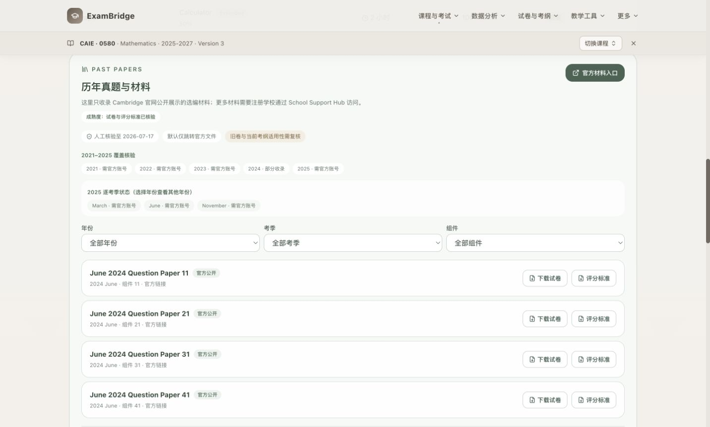
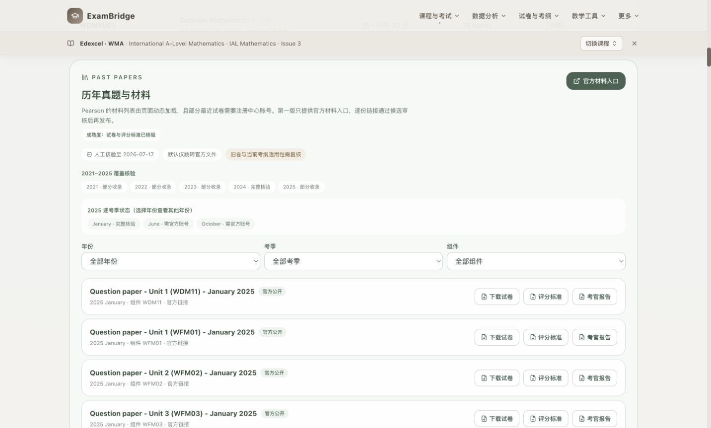
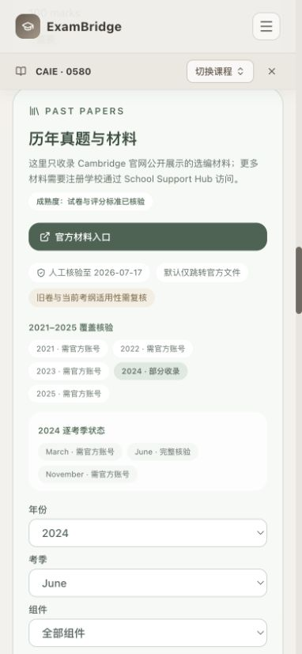
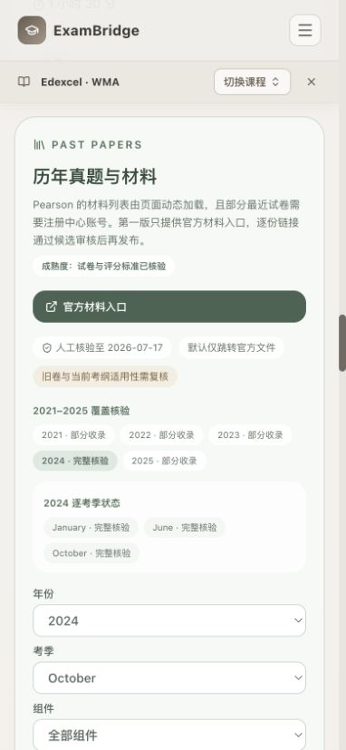
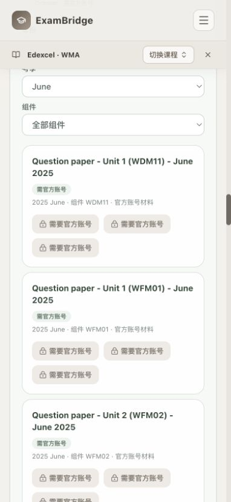
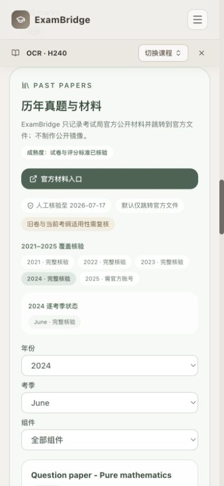

# ExamBridge 10-course past-paper visual acceptance — 2026-07-17

## Scope

- Baseline commit: `6f59f5a0da80c8fd1736b2fe97d442d0e3e00dcf`
- Preview: isolated static production build with this acceptance round's pending UI fixes layered on the baseline
- Courses: CAIE 0580, 0606, 9231, 9709; Pearson 1MA1, 4MA1, 9MA0, 9FM0, YMA01; OCR H240
- Browsers/viewport: Chromium desktop 1440×900 and representative mobile checks at 390×844
- External documents were not downloaded. Link controls were inspected without mirroring files.

## Findings fixed during acceptance

1. Account-restricted Pearson cards incorrectly displayed `官方公开` and `本站授权文件`. They now display `需官方账号` and `官方账号材料`, while all download controls remain locked.
2. Past-paper year/series/component filters persisted when the catalog changed. The library now resets with the active qualification, so one course's filter cannot hide another course's assets.
3. The board normalizer treated `Cambridge OCR` as CAIE before checking OCR, so the H240 catalog was omitted from the exam overview. OCR matching now takes precedence and H240 renders its verified catalog.

## Desktop evidence

| Catalog | Visible QP sets | Download links | Coverage years | Page overflow | Console errors |
| --- | ---: | ---: | ---: | ---: | ---: |
| CAIE 0580 | 4 | 4 | 5 | 0 px | 0 |
| CAIE 0606 | 2 | 2 | 5 | 0 px | 0 |
| CAIE 9231 | 4 | 4 | 5 | 0 px | 0 |
| CAIE 9709 | 6 | 6 | 5 | 0 px | 0 |
| Pearson 1MA1 | 54 | 42 | 5 | 0 px | 0 |
| Pearson 4MA1 | 52 | 40 | 5 | 0 px | 0 |
| Pearson 9MA0 | 20 | 16 | 5 | 0 px | 0 |
| Pearson 9FM0 | 50 | 40 | 5 | 0 px | 0 |
| Pearson YMA01 | 198 | 162 | 5 | 0 px | 0 |
| OCR H240 | 12 | 12 | 5 | 0 px | 0 |

The difference between QP-set and download-link counts is intentional: recent Pearson materials that require a centre/teacher account remain catalogued but do not expose a download link.

## Mobile evidence

| Course and filter | Visible QP sets | Download links | Page overflow |
| --- | ---: | ---: | ---: |
| YMA01 · 2024 October | 8 | 8 | 0 px |
| CAIE 0580 · 2024 June | 4 | 4 | 0 px |
| OCR H240 · 2024 June | 3 | 3 | 0 px |
| YMA01 · 2025 June restricted view | locked | 0 | 0 px |

## Screenshots

### Representative desktop views

### Representative mobile views

The folder also contains one desktop screenshot for every remaining pilot course.

## Automated regression

- Past-paper catalog unit test: 10/10 passed.
- Targeted ESLint: passed after replacing the effect-based reset with qualification-keyed remounting.
- Static production build and bundle budget: passed.
- Targeted Playwright check: 2/2 passed (desktop Chromium and 390 px mobile).

This acceptance did not push GitHub, update `gh-pages`, deploy production, or access the server-persistent PDF directory.
